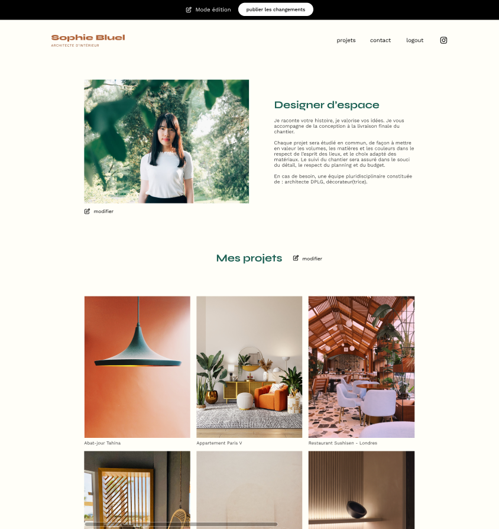
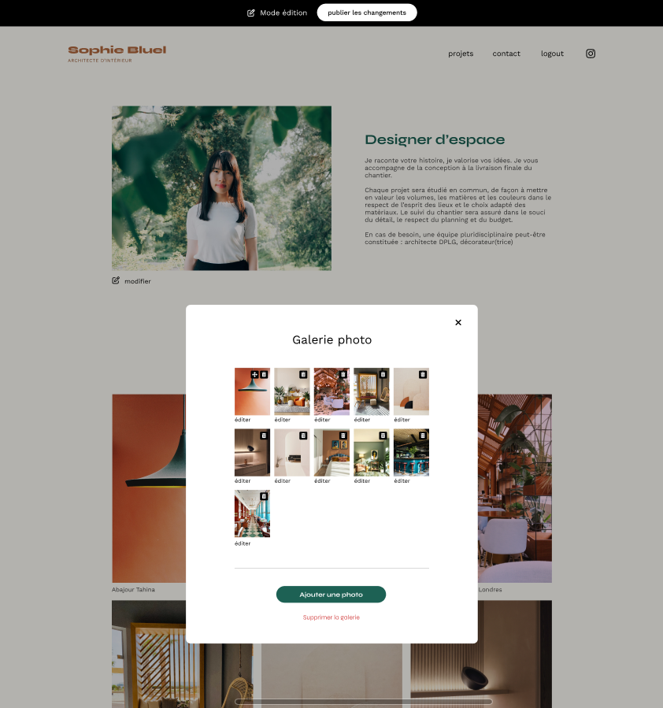

# Portfolio d'Architecte - Projet AchiWebos

Bienvenue dans le README du projet Portfolio d'Architecte, réalisé en collaboration avec l'agence AchiWebos. Dans ce projet, j'ai occupé le rôle de développeur front-end et j'ai eu l'opportunité de contribuer au développement d'une plateforme qui met en valeur les créations architecturales exceptionnelles.

## Aperçu

Le Portfolio d'Architecte est une vitrine numérique mettant en avant les réalisations architecturales uniques et inspirantes. En tant que développeur front-end au sein de l'agence AchiWebos, j'ai travaillé sur la conception et l'implémentation de l'interface utilisateur qui permet aux visiteurs de découvrir ces chefs-d'œuvre architecturaux.

## Fonctionnalités

- Affichage visuel élégant des projets architecturaux avec des images et des descriptions détaillées.
- Navigation fluide entre les différents projets grâce à une interface utilisateur intuitive.
- Possibilité de filtrer les projets par catégories, matériaux utilisés et emplacements.
- Intégration de l'API pour récupérer dynamiquement les données des projets et les afficher sur le front-end.

## Ma Contribution

En plus de mon rôle de développeur front-end, j'ai également collaboré avec le développeur back-end de l'équipe pour mettre en place l'API qui alimente le contenu du portefeuille. Mon implication dans le développement de l'API comprenait :

- Conception et documentation de l'architecture de l'API pour assurer une communication efficace entre le front-end et le back-end.
- Implémentation des points d'extrémité de l'API pour récupérer les données des projets depuis la base de données.
- Mise en place de la logique de pagination pour gérer l'affichage de nombreux projets.
- Intégration de la sécurité des données et des autorisations pour protéger les informations sensibles.

## Technologies Utilisées

- HTML, CSS, JavaScript pour la création de l'interface utilisateur interactive.
- Vue.js comme framework front-end pour faciliter la gestion de l'état et des composants.
- Node.js et Express pour développer l'API back-end.
- MongoDB comme base de données pour stocker les informations sur les projets.

## Instructions d'Installation

1. Clonez ce dépôt sur votre machine locale.
2. Naviguez vers le dossier du projet.
3. Exécutez `npm install` pour installer les dépendances.
4. Utilisez `npm run start` pour lancer l'application en mode de développement.

N'hésitez pas à explorer le code source pour en apprendre davantage sur la mise en œuvre et la structure du projet.

## Captures d'Écran

---

Ce projet a été une opportunité passionnante pour moi de combiner mon intérêt pour l'architecture avec mes compétences en développement. J'espère que ce portfolio numérique permettra de mettre en valeur les talents exceptionnels de notre équipe d'architectes et de développeurs.

Pour toute question ou collaboration potentielle, n'hésitez pas à me contacter.

**Développeur Front-End:** Lucas O.
**Agence:** AchiWebos
**Date:** MARS 2023
